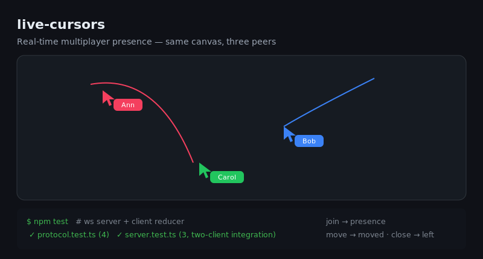

# live-cursors

[](https://github.com/josh/live-cursors/actions)
[](https://www.typescriptlang.org/)
[](LICENSE)

The "Figma multiplayer" demo as a tiny, reusable library: real-time cursors and presence over WebSockets. A transport-agnostic protocol + reducer, a small `ws` server, and a throttled browser client — all in a few hundred lines.



## Run the demo

```bash
npm install
npm run build
npm start            # ws://localhost:8787
```

Serve `demo.html` and open it in two windows — you'll see each other's cursors move live.

## Use the client

```ts
import { connect } from "live-cursors";

const client = connect({
  url: "wss://your-host:8787",
  name: "Ada", color: "#f43f5e",
  onChange: (peers, selfId) => render(peers, selfId),
});

window.addEventListener("mousemove", (e) => client.move(e.clientX, e.clientY)); // throttled
```

## Use the server

```ts
import { createServer } from "live-cursors";
createServer({ port: 8787 });          // or { server } to attach to an http.Server
```

## Protocol

Client → server: `join` · `move` · `leave`.
Server → client: `welcome` · `presence` (full snapshot) · `moved` · `left`.

The state is kept in sync by a **pure reducer**, `applyServerMessage(peers, msg)`, so the tricky part is unit-tested with no sockets — and a separate integration test spins up the real server and connects two `ws` clients end-to-end.

## Development

```bash
npm test          # 7 tests (protocol reducer + two-client integration)
npm run build     # tsc, clean
```

## License

MIT
